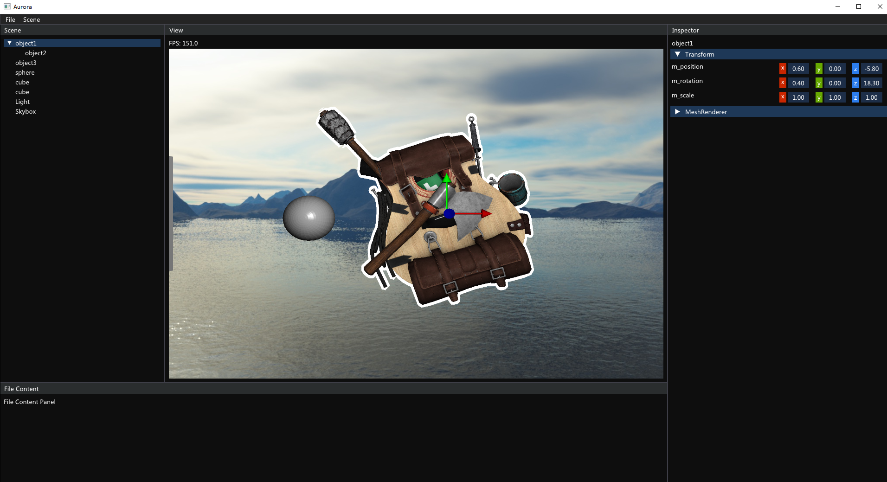

# Aurora
A toy OpenGL Render Engine.

## Platform support
| Platform | CI |
|----------|:--:|
| Windows | 

 

 |

## Feature
Currently only Phong shading is supported and the system is not quite interactive. Other features will be added in the future.

## Snapshots

## How to build
Only MinGW and MSVC are tested. MSYS2 MinGW64 is recommended as the version of its g++ has a good support for C++17. g++ with versions lower than 9.0.0 may not work as std::filesystem is not supported in these versions. Run `MinGW_build.bat` or `MSVC_build.bat` to build the project.

## Credits
Credits for models used in this project can be found in [CREDITS](./CREDITS)