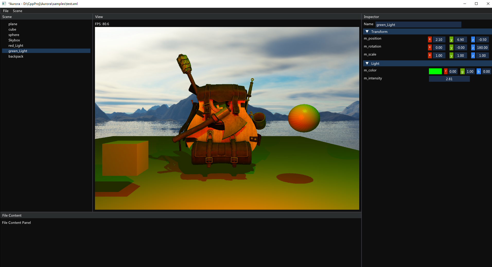

# Aurora
A toy OpenGL Render Engine.

## Platform support
| Platform | CI |
|----------|:--:|
| Windows | 

 |

## Feature
* Phong shading
* Skybox
* Outline
* Shadow mapping
* Bounding Volume Hierarchy

## Snapshots

## How to build
Only MSVC is tested. Run `MSVC_build.bat` to build the project.

## Credits
Credits for models used in this project can be found in [CREDITS](./CREDITS)