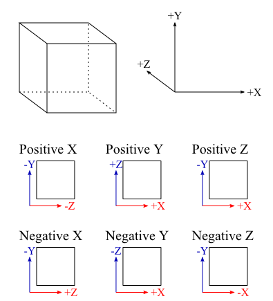
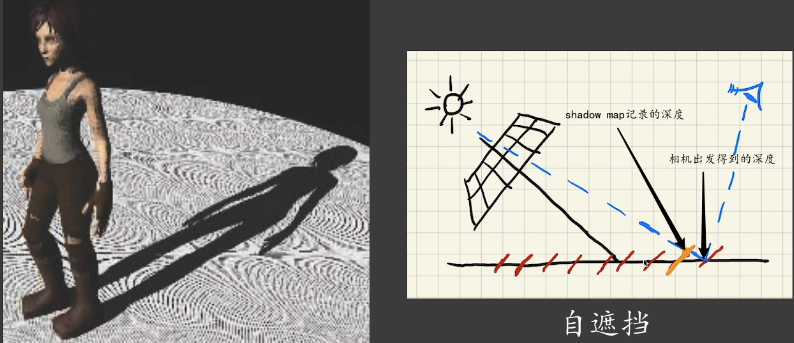

Here list all techniques implemented in this simple render engine, some implementation details are introduced.

# Outline

TODO

# Shadow

## Shadow Mapping

See from each point light source towards PosX、NegX、PosY、NegY、PosZ、NegZ to get the scene depth， use these depth texture to form a cubemap as shadow map. Note the up direction of cubemap rendering\(it's upside down in Opengl\)。

In the subsequent rendering pass，calculate the distance between sample points and light source, and compare it with the nearest occluder distance of the light source recorded in shadow map. Because z in shadow map is not linear，a recovery is needed.

From the perspective projection formula

$$
zClip = \frac{far + near}{far - near} + \frac{1}{depth} * (\frac{-2\cdot far \cdot near}{far - near})
$$

the depth recovery formula can be derived as

$$
depth = \frac{far\cdot near}{far -z\cdot(far-near)}
$$

The self-occlusion issue caused by precision and discrete shadow map should be care handled by introducing $\epsilon$ and using angle between light and normal as a factor.

For directional light, a 2D shadow map is enough. The shadow map is generated using orthographic projection with light source looking at its direction. But there are more things should pay attention to. As the shadow map is generated using orthographic projection, the frustum should be large enough to cover the whole scene viewed from the camera. But as the resolution of shadow map is limited, too large frustum will cause low quality shadow and even missing shadow for small objects that fail to occupy a pixel in shadow map when rasterized. So a cascaded shadow map(CSM) strategy should be introduced, which has not been implemented yet.